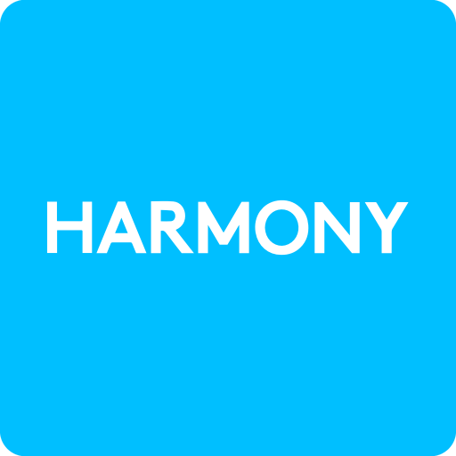

  
  
  
  

---

A driver to control harmony activities and linked devices.

# Driver Control4 Harmony

This driver is very early-developpement state, please do not install this version on production site. 

# Installation 

Go to the drivers tab, do "add or update driver or agent" and add it in composer, then install the "hub" driver, all the procedure to follow is in the documentation tab

# Issues

Please, if you encounter a problem, a bug, contact me by opening an issue ticket or on discord: CaptainCalvie#3598

